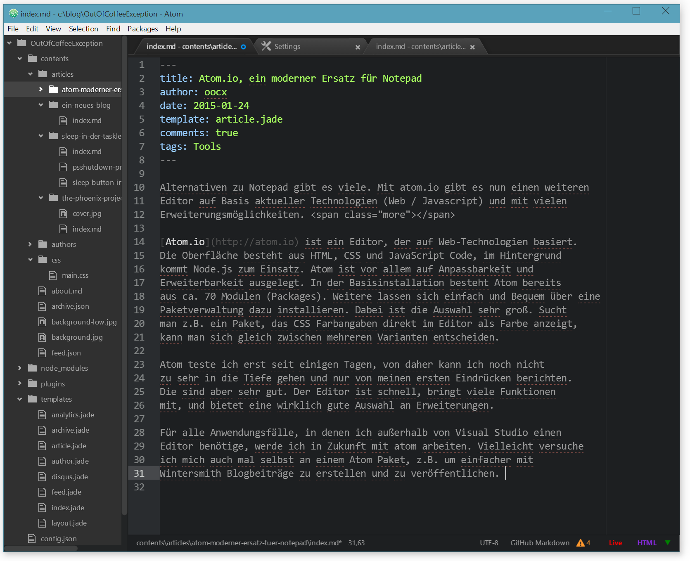
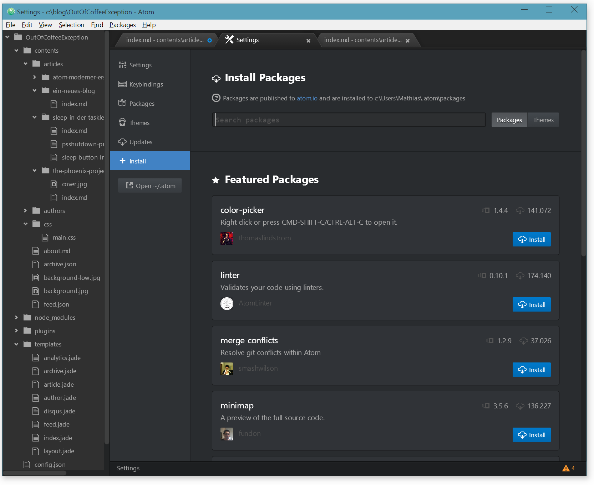

Alternativen zu Notepad gibt es viele. Mit atom.io gibt es nun einen weiteren
Editor auf Basis aktueller Technologien (Web / Javascript) und mit vielen
Erweiterungsmöglichkeiten. 

[Atom.io](http://atom.io) ist ein Editor, der auf Web-Technologien basiert.
Die Oberfläche besteht aus HTML, CSS und JavaScript Code, im Hintergrund
kommt Node.js zum Einsatz. Atom ist vor allem auf Anpassbarkeit und
Erweiterbarkeit ausgelegt. In der Basisinstallation besteht Atom bereits
aus ca. 70 Modulen (Packages). Weitere lassen sich einfach und Bequem über eine
Paketverwaltung dazu installieren. Dabei ist die Auswahl sehr groß. Sucht
man z.B. ein Paket, das CSS Farbangaben direkt im Editor als Farbe anzeigt,
kann man sich gleich zwischen mehreren Varianten entscheiden.

Atom teste ich erst seit einigen Tagen, von daher kann ich noch nicht
zu sehr in die Tiefe gehen und nur von meinen ersten Eindrücken berichten.
Die sind aber sehr gut. Der Editor ist schnell, bringt viele Funktionen
mit, und bietet eine wirklich gute Auswahl an Erweiterungen.

Für alle Anwendungsfälle, in denen ich außerhalb von Visual Studio einen
Editor benötige, werde ich in Zukunft mit atom arbeiten. Vielleicht versuche
ich mich auch mal selbst an einem Atom Paket, z.B. um einfacher mit
Wintersmith Blogbeiträge zu erstellen und zu veröffentlichen.
